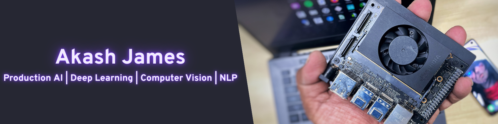

  

  
  

---
<h2 align="center"><b>I love tinkering with the latest and greatest in technology! 🛠</b></h2>

- 🌱 Currently honing my skills in Artificial Intelligence/Deep Learning/Computer Vision! 💪🏼
- 👯 Open to collaborate
- ⚡ When I don't code, I love beatboxing!

<h2 align="center"><b> Connect with me 🤝 </b></h2>

  
  
  
  
  

<h2 align="center"><b> Join the Kn1ghtF1re community </b></h2>

  

<h2 align="center"><b> Streaks 🔥 </b></h2>

  

<h2 align="center"><b>📈 Stats for Nerds</b></h2>

    
    
    

---

<h2 align="center"><b> The mastery of Tech! </b></h2>

Mastering different parts of technology is absolutely necessary! Here's my skillset in a nutshell. 🌰

<h2 align="center"><b> Code Skills </b></h2>

    
    
    
    
    

<h2 align="center"><b> AI-DL-CV-NLP Stack </b></h2>

    
    
    
    
    
    
    
    

<h2 align="center"><b> Production Stack </b></h2>

    
    
    
    
    
    
    
    
    
    
    

<h2 align="center"><b> Other Tools </b></h2>

    
    
    
    
    
    

<h2 align="center"><b> Preferred Dev Environment </b></h2>

    
    
    
    

<h2 align="center"><b> WorkSpace </b></h2>

    
    
    
    

---

<h2 align="center"><b> Blog Post </b></h2>

<!-- BLOG-POST-LIST:START -->
- [How an AI organisation can make a difference during the pandemic](https://akash-james.medium.com/how-an-ai-organisation-can-make-a-difference-during-the-pandemic-db63ee396df9?source=rss-47256195ac2d------2)
- [What it takes to be an Artificial Intelligence Architect](https://akash-james.medium.com/what-it-takes-to-be-an-artificial-intelligence-architect-ed7757c504fb?source=rss-47256195ac2d------2)
- [Train models like a pro with NVIDIA TLT 3.0](https://akash-james.medium.com/train-models-like-a-pro-with-nvidia-tlt-3-0-54ea20467661?source=rss-47256195ac2d------2)
- [YOLOv4 with CUDA powered OpenCV DNN](https://towardsdatascience.com/yolov4-with-cuda-powered-opencv-dnn-2fef48ea3984?source=rss-47256195ac2d------2)
- [Hermes — Wildfire Detection using NVIDIA Jetson and Ryze Tello](https://towardsdatascience.com/hermes-wildfire-detection-using-nvidia-jetson-and-ryze-tello-8da123f05c64?source=rss-47256195ac2d------2)
<!-- BLOG-POST-LIST:END -->

➡️ [more blog posts...](https://akash-james.medium.com)

---